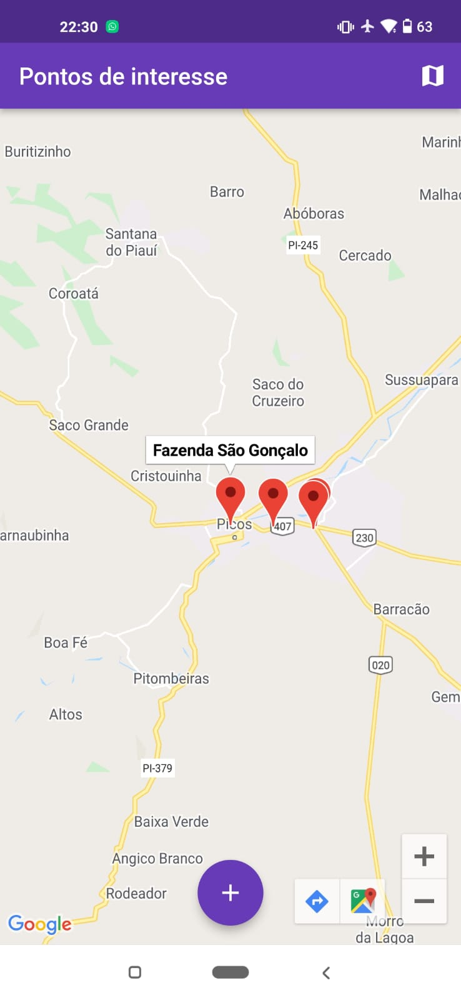
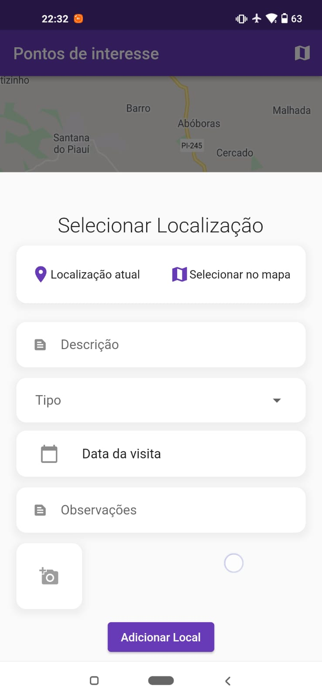
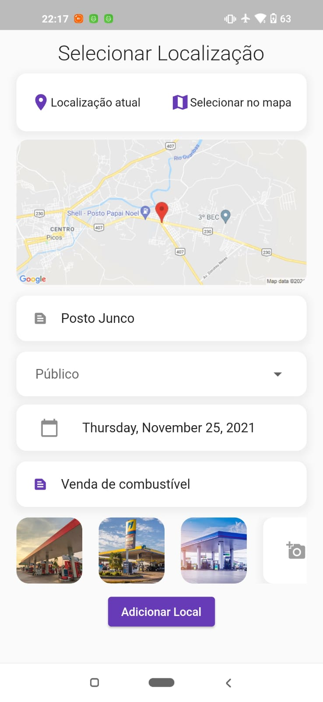
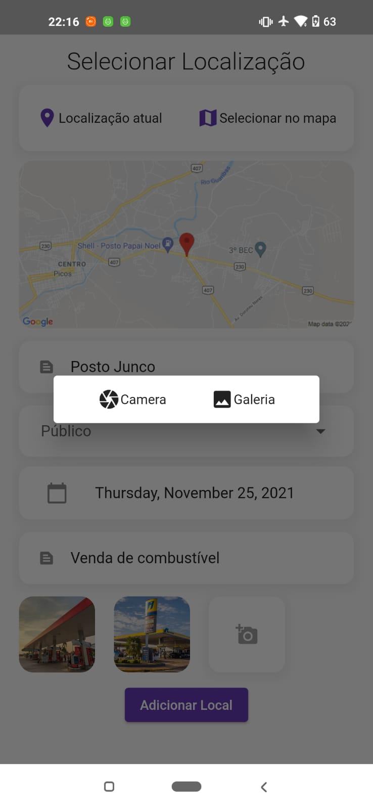
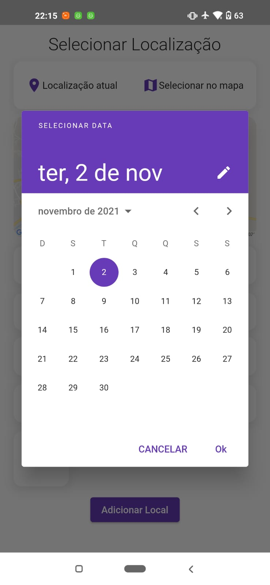
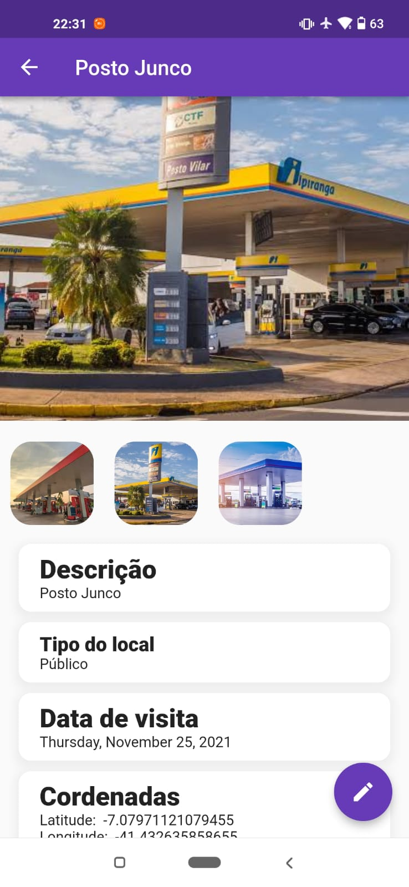
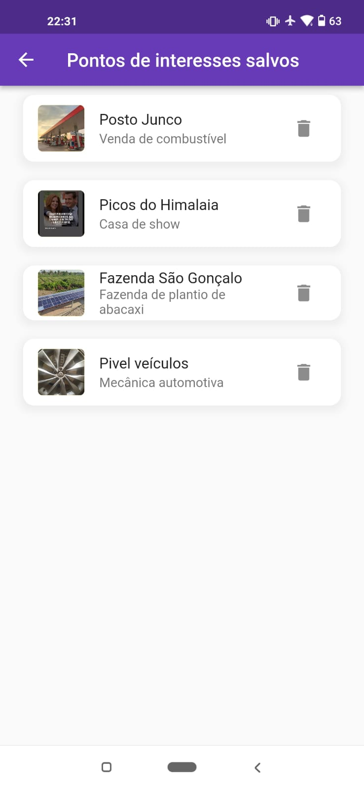

# Engeselt Desafio

App desenvolvido como critério para seleção de desenvolvedor Flutter na Engeselt Softwares

---

## Sobre o desafio

Desenvolva um aplicativo mobile com Flutter, onde o usuário consiga salvar pontos de interesse em um mapa através de coordenadas do GPS do aparelho ou apontamento manual, com os atributos de "Descrição", "Tipo: Privado, Publico, Outros", "Data Visita", "Observações" e anexar fotos da câmera ou da galeria do dispositivo ao ponto de interesse. Estes pontos poderão ser visualizados no mapa e o usuário poderá fazer as operações básicas (Criar, Editar, Excluir e Consultar). Ao clicar no ponto de interesse no mapa, permitir também que seja chamado uma função de navegação até o local. Use sua criatividade para fazer uma maneira simples e objetiva.


## Screens

<p align="center">
   
   
   
   
   
   
   
   
</p>

---


## ⚠️ Requisitos

Você deve ter instalado Flutter e Dart em sua máquina. Para isso, consulte o guia de instalação em: https://flutter.dev/docs/get-started/install


<h2 align="center"> Como Usar 🤔</h2>

   ```
   
   - Clone este repositório:
   $ git clone https://github.com/firminoazevedo/engeselt_test

   - entre no diretório:
   $ cd escriboTesteTres

   - Para instalar as dependências:
   $ flutter pub get

   - Para iniciar o app: 
   $ flutter run
   ```

---

## Futuras Implementações
Devido a restrições de tempo, algumas implementações adicionais deixaram de ser implementadas

- [ ] Animações
- [ ] Salvar em banco de dados online
- [ ] Editar um local

---


Feito com :heart: por [Firmino Neto](https://github.com/firminoazevedo) 🚀